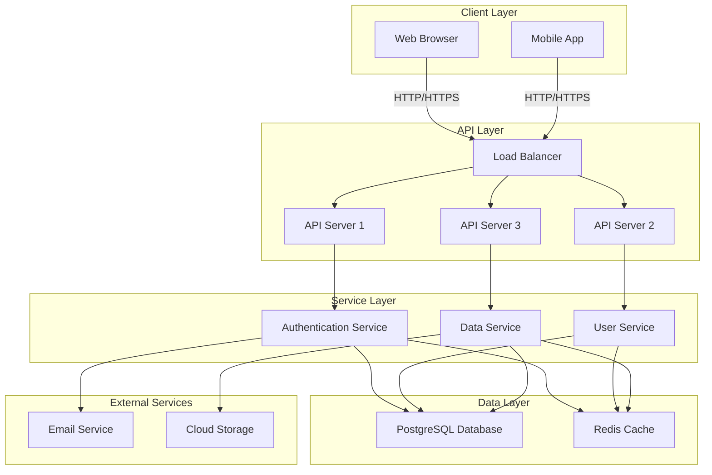

# Architecture Overview

This document describes the high-level architecture of the system.

## System Architecture Diagram

## Components

### Client Layer
- **Web Browser**: Desktop and tablet access to the application
- **Mobile App**: Native mobile application

### API Layer
- **Load Balancer**: Distributes incoming traffic across API servers
- **API Servers**: Handle incoming requests and route to appropriate services

### Service Layer
- **Authentication Service**: Manages user authentication and authorization
- **User Service**: Handles user profile and account management
- **Data Service**: Manages application data operations

### Data Layer
- **PostgreSQL Database**: Primary data storage
- **Redis Cache**: In-memory caching for performance

### External Services
- **Email Service**: Sends transactional and notification emails
- **Cloud Storage**: Stores files and media assets

## Communication Flow

1. Clients send requests to the Load Balancer
2. Load Balancer routes requests to available API servers
3. API servers process requests using appropriate services
4. Services interact with the database and cache layer
5. External services are called as needed for additional functionality
